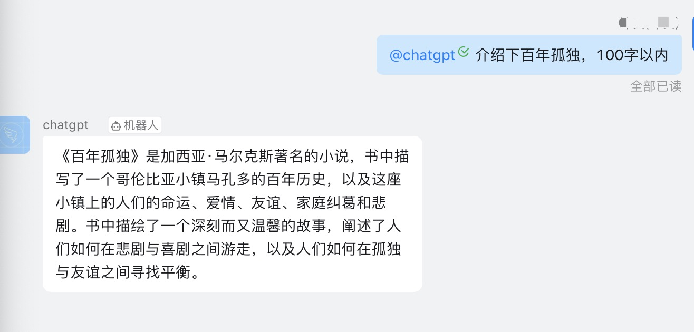

# 介绍

集成chatgpt与钉钉机器人,  效果图如下




# 快速开始

需要准备的：

1. 申请一个**OpenAi  API key**,  从[openai platform](https://platform.openai.com/account/api-keys) 生成

2. 获取钉钉机器人token 

   - 登录钉钉开放平台， 选择企业内部开发, 机器人

     

   - 当机器人创建成功后， 钉钉会自动生成一个调试群

      

   - 进入群里， 点击智能群助手， 下方会有一个ddd123的机器人,  点击， 获取webhook链接, 从链接里获取token

     ```
     https://oapi.dingtalk.com/robot/send?access_token=xxxx
     ```

     

## 部署服务

### 程序启动

1. 安装依赖

```shell
pip3 install -r requirements.txt
```

2. 启动程序， 将**${openai_xx}**替换openai api key,  **${dd_xx}**替换钉钉的token

```shell
API_KEY=${openai_xx} DD_TOKEN=${dd_xx} python3 main.py
```

3. 服务监听的端口是8080


### Docker启动

将**${openai_xx}**替换openai api key,  **${dd_xx}**替换钉钉的token

```shell
docker run -p 8080:8080 -e API_KEY=${openai_xx} -e DD_TOKEN=${dd_xx} -d registry.cn-hangzhou.aliyuncs.com/public_mgg/chatgpt:latest
```


## 回到钉钉开放平台， 配置机器人

点击开发管理, 配置服务的地址， 将图下面的ip修改为实际部署机器的ip


## 测试

在群内@机器人
